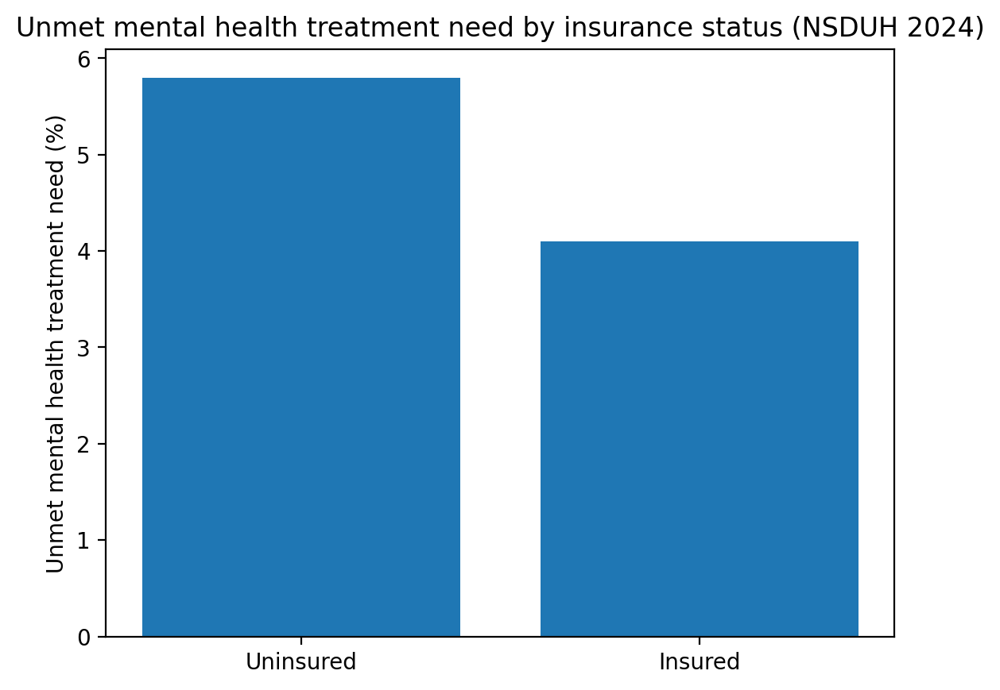
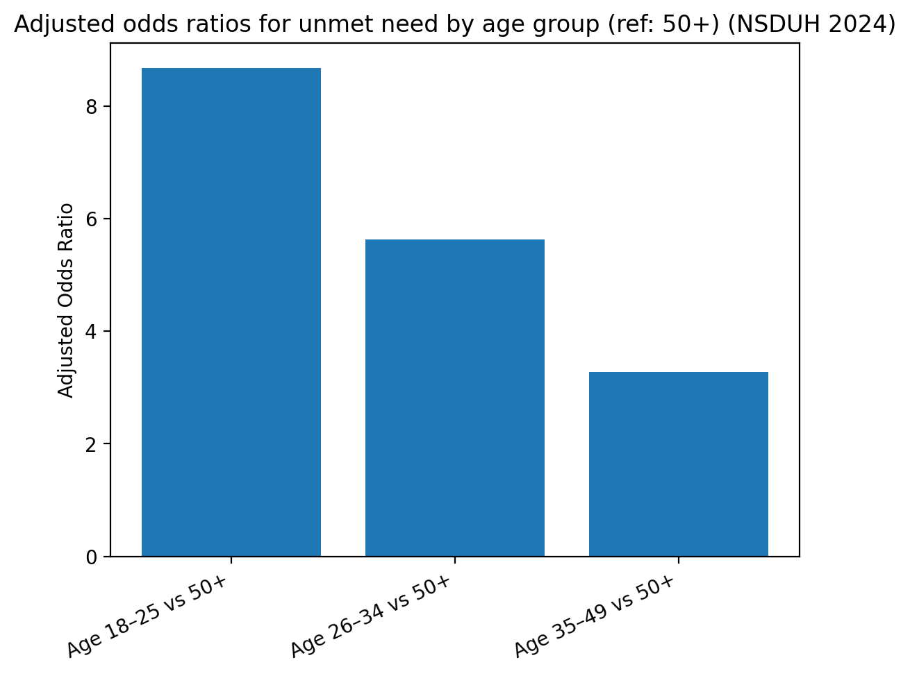

# Insurance Disparities in Unmet Mental Health Treatment Need (NSDUH 2024)

This repository contains a survey-weighted analysis of **unmet mental health treatment need** among U.S. adults using the **2024 National Survey on Drug Use and Health (NSDUH)**.

## Research question
Among U.S. adults (18+), is being **uninsured** associated with higher odds of **unmet mental health treatment need**?

## Data source
- **Dataset:** 2024 NSDUH public-use file (SAMHSA)
- **Population:** Civilian, non-institutionalized U.S. adults (18+)
- **Analytic sample:** N = 32,427 (weighted to ~191 million U.S. adults)

> ⚠️ NSDUH microdata are not included in this repo. See `/data/README_data_access.md` for how to obtain the public-use file.

## Key measures
- **Outcome:** Unmet mental health treatment need (past 12 months)
- **Exposure:** Insurance status (insured vs uninsured)
- **Covariates:** Age group, sex, race/ethnicity, education

## Methods
- Weighted descriptive statistics and bivariate comparisons using NSDUH complex survey design.
- **Survey-weighted logistic regression (SPSS Complex Samples / CSLOGISTIC)** accounting for stratification, clustering, and person-level weights.

## Key findings
- Overall weighted prevalence of unmet mental health treatment need: **4.3%**
- Unmet need prevalence:
  - **Uninsured:** 5.8%
  - **Insured:** 4.1% (design-adjusted p < .001)
- Adjusted survey-weighted model:
  - **Uninsured vs insured:** AOR = **1.32** (95% CI: 0.99–1.75), p = .056
## Key Visualizations

## Files to review
- **Final paper:** `/docs/Final_Report.docx`
- **Tables (Excel + CSV):** `/outputs/`
- **Figures:** `/docs/Figures/`
- **SPSS syntax and run steps:** `/code/`
- **Raw SPSS outputs (.spv):** `/raw_spss_outputs/`

## Reproducibility (high level)
1. Obtain NSDUH 2024 public-use data (see `/data/README_data_access.md`).
2. Open the dataset in SPSS.
3. Create/load a Complex Samples Plan file (.csaplan) using NSDUH design variables (see `/code/README_code_steps.md`).
4. Run syntax in `/code/spss_syntax.sps`.
5. Export tables/figures to match `/outputs/` and `/docs/Figures/`.

## Limitations
- Cross-sectional design (no causal inference)
- Self-reported measures (possible recall/reporting bias)
- Public-use data limit some contextual variables (e.g., geography/provider access)
- Potential residual confounding

## Author
Asmita Thapa — MPH (Epidemiology & Biostatistics)
